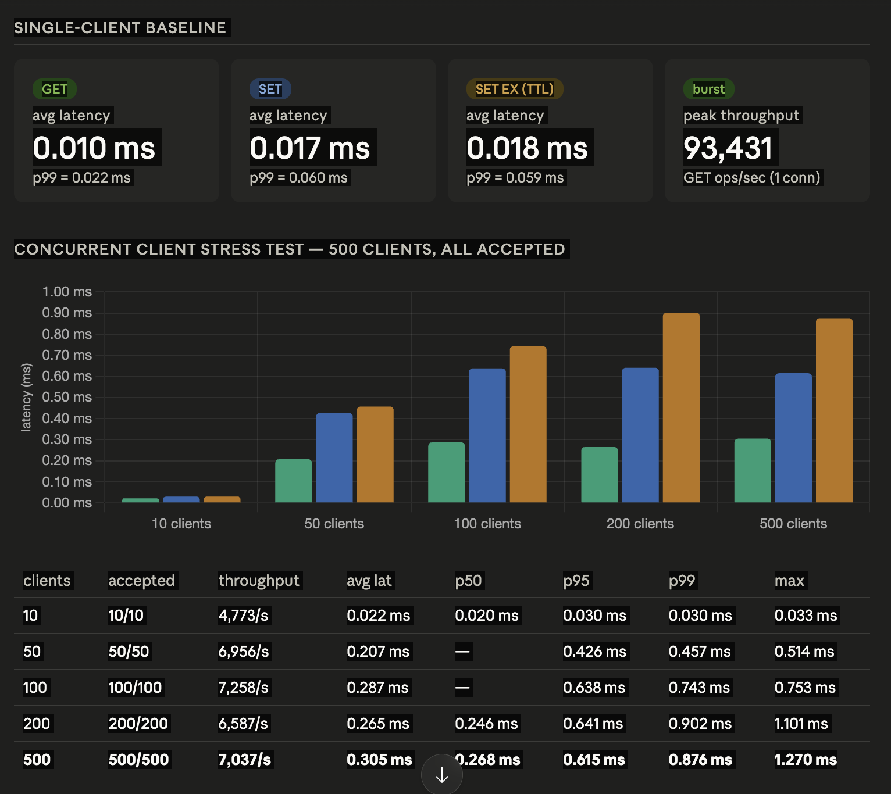
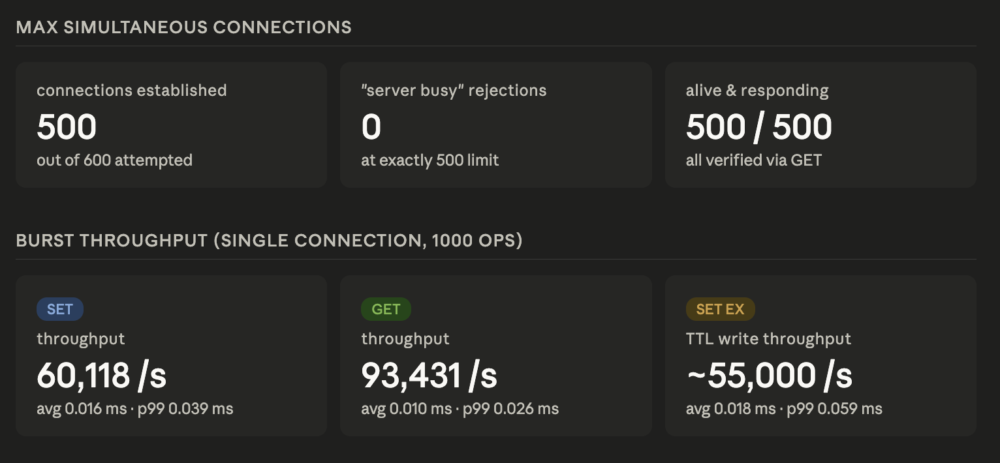

# Mini Redis : Multithreaded Cache Engine

[](https://mini-redis-wdls.onrender.com/)

### TCP Server • LRU Cache • TTL (Heap Optimized) • WAL • Snapshot (RDB) • Replication • Web Dashboard

This project implements a **Redis-like in-memory key-value store written in C++** that demonstrates advanced backend system design concepts.

It supports **O(1) key-value operations**, **concurrent client handling**, **Write-Ahead Logging (WAL)**, **snapshot-based persistence**, **LRU eviction**, **heap-optimized TTL expiry**, and **master-slave replication**. 

To make the system fully observable and accessible, it features a **dual-interface**: interact with the C++ core directly via raw TCP in the terminal, or use the **Node.js Proxy Bridge** to monitor live topology and manage keys through a modern Web Dashboard.

---

# Demo

🚀 **[Live Web Dashboard](https://mini-redis-wdls.onrender.com/)** - *Open this link in multiple tabs to see real-time multi-client synchronization in action!*

## Working Video

- **Detail Final Video:** - https://youtu.be/doOxAjvSMHA?si=tC-GS-1Lszt75k5M
- **Raw TCP Terminal:** https://youtu.be/UEt7pb8lUZ0
- **Web Dashboard:** - https://youtu.be/PY0NDeWMnAw?si=_Oiqgp-zre6EgUOf
---

# Project Highlights

## Fast Key-Value Store
- Uses **unordered_map (hash map)** for near O(1) access.
- Supports core operations:
  - `SET key value`
  - `SET key value EX seconds`
  - `GET key`
  - `DEL key`
  - `EXISTS key`
  - `TTL key`
  - `INCR key`
  - `DECR key`

---

## Dual-Interface (Terminal & Web UI)
- **Raw TCP Terminal:** Connect directly to the C++ server using the native client for a hardcore CLI experience.
- **Web Dashboard:** A zero-dependency Node.js proxy that bridges browser WebSockets to raw TCP. Features a vanilla JS frontend showing live client sessions, a visual key explorer, and an in-browser CLI.

---

## TCP Server & Concurrency
- Built using low-level **socket programming** (`socket()`, `bind()`, `listen()`, `accept()`).
- Safely handles multiple concurrent client connections.
- Enforces maximum client limits (returns `"Server busy"`) and implements graceful shutdown (`Ctrl + C`) to prevent abrupt crashes.

---

## Multithreaded Request Handling
- Each client handled in a **separate thread**
- Supports concurrent connections
- Improves responsiveness and throughput

---

## Write-Ahead Logging (WAL)
- All write operations are safely logged to `data.log`.
- Protected via `std::mutex` to ensure thread-safe disk writes.
- Ensures data durability and enables full recovery after a crash.

---

## Snapshot Persistence (RDB)
- Periodically saves the full database state to `snapshot.rdb`.
- Improves startup time significantly compared to replaying an endless WAL.
- **WAL Compaction:** After a successful snapshot, the WAL (`data.log`) is cleared to prevent unbounded log growth.

---

## WAL + Snapshot Integration
- Hybrid persistence model:
  - Snapshot → full database state
  - WAL → recent changes

Startup flow:
1. Load snapshot
2. Replay WAL

---

## WAL Compaction
- After snapshot:
  - WAL (`data.log`) is cleared
- Prevents unbounded log growth

---

## LRU Cache (Memory Management)
- Implements **Least Recently Used eviction**.
- Uses: `unordered_map` + `doubly linked list`.
- Removes the least recently accessed keys when capacity is exceeded in exact O(1) time.

---

## TTL Expiry (Heap Optimized)
- Uses a **Min-heap (priority queue)** for expiry tracking.
- Complexity improved: O(n) → O(log n).
- A background expiry thread periodically cleans up expired keys without blocking main client operations.
- Efficient expiration without full scan

---

## Background Expiry Thread
- Runs periodically
- Removes expired keys using heap
- Avoids blocking main operations

---

## Logging System
- Replaced raw `cout` with structured logging:
  - INFO
  - DEBUG
  - ERROR
- Includes timestamps
- Improves observability and debugging

---

## Replication (Master-Slave)
- **Initial Sync:** When a slave connects, the Master sends a full snapshot.
- **Live Updates:** Master continuously forwards write commands (`SET`, `DEL`, `INCR`, `DECR`) to connected slaves to ensure state consistency.

---

## Initial Sync (State Synchronization)
- When slave connects:
  1. Master sends full snapshot
  2. Slave loads snapshot
  3. Then receives live updates

- Ensures consistency for late-joining slaves
  
---


## Performance Benchmarks

### Concurrent Client Support

- Maximum Concurrent Clients Supported: 500 (can be changed , for testing I kept MAX_CLIENTS = 500)
- Clients Successfully Accepted: 500/500
- Rejection Rate: 0%
- Connection Verification: All clients validated through live GET requests

### Single-Client Baseline Performance

| Operation | Avg Latency | P99 Latency | Throughput |
|---|---|---|---|
| GET | 0.010 ms | 0.022 ms | 93,431 ops/sec |
| SET | 0.017 ms | 0.060 ms | 60,118 ops/sec |
| SET EX (TTL) | 0.018 ms | 0.059 ms | ~55,000 ops/sec |

### Concurrent Stress Test Performance

| Clients | Throughput | Avg Latency | P95 Latency | P99 Latency | Max Latency |
|---|---|---|---|---|---|
| 10 | 4,773 ops/sec | 0.022 ms | 0.030 ms | 0.030 ms | 0.033 ms |
| 50 | 6,956 ops/sec | 0.207 ms | 0.426 ms | 0.457 ms | 0.514 ms |
| 100 | 7,258 ops/sec | 0.287 ms | 0.638 ms | 0.743 ms | 0.753 ms |
| 200 | 6,587 ops/sec | 0.265 ms | 0.641 ms | 0.902 ms | 1.101 ms |
| 500 | 7,037 ops/sec | 0.305 ms | 0.615 ms | 0.876 ms | 1.270 ms |

### Data Structure Complexity

| Feature | Complexity |
|---|---|
| GET | O(1) average |
| SET | O(1) average |
| DELETE | O(1) average |
| TTL Insert | O(log n) |
| TTL Expiry | O(log n) |
| LRU Update | O(1) |

### Performance Highlights

- Sustained sub-millisecond average latency under 500 concurrent clients
- Maintained p99 latency below 1 ms at maximum tested load
- Achieved 93K+ GET ops/sec on single connection benchmark
- TTL-enabled writes introduce negligible overhead compared to standard SET operations
- Stable throughput maintained under heavy concurrent access

### Benchmark Screenshots






# System Architecture

```
       [ Web Dashboard UI ]
               ↓ (WebSocket / HTTP)
       [ Node.js Proxy Bridge ]
               ↓ (Raw TCP)
=======================================
       [ C++ Mini Redis Server ]
=======================================
               ↓
        [ Command Parser ]
               ↓
    [ KV Store (RAM) + LRU + TTL ]
               ↓
      [ Persistence Layer ]
      ├── WAL (data.log)
      └── Snapshot (snapshot.rdb)
               ↓
     [ Replication Layer ]
      └── TCP Slave Nodes
```


---

# Components

| Layer | Responsibility |
|------|---------------|
| Client | Sends commands |
| Server | Handles TCP connections and routing |
| CommandParser | Parses input into tokens |
| KVStore | Core data storage + LRU + TTL |
| Logger | Structured logging |
| WAL | Durable logging of writes |
| Snapshot | Full state persistence |
| Replication | Sync between master and slaves |

---

# Project Structure
```
├── MiniRedis/                   <-- C++ Backend Core
│   ├── store/
│   │   ├── KVStore.h / .cpp
│   ├── parser/
│   │   ├── CommandParser.h / .cpp
│   ├── server/
│   │   ├── Server.h / .cpp
│   ├── utils/
│   │   ├── Logger.h / .cpp
│   ├── main.cpp
│   ├── client.cpp
│   ├── Makefile
│   ├── data.log
│   └── snapshot.rdb
│
└── web-dashboard/               <-- Node.js Proxy & UI
    ├── public/ 
    │   ├── app.js
    │   ├── index.html
    │   └── style.css
    ├── package.json
    └── server.js
```
---

## Getting Started

### Prerequisites
- macOS / Linux environment
- `g++` (C++20 support)
- `make`
- Node.js v20+

### 1. Start the C++ Backend
Open a terminal, navigate into the `MiniRedis` directory, compile the project, and start the server:

```bash
cd MiniRedis
make all
make run
```
(The master server is now running on port 8080).


### 2. Choose Your Interface
Option A: Terminal Client Open a new terminal, navigate to the MiniRedis directory, and run the client:

```bash
cd MiniRedis
./client
```

Option B: Web Dashboard Open a new terminal, navigate to the web-dashboard directory, install dependencies, and start the proxy:

```bash
cd web-dashboard
npm install
npm run dev
```
Navigate to http://localhost:5173 in your browser.


---

# How the System Works

## Request Flow

Example:
SET name Jayant


Steps:
1. Client (Terminal or UI Bridge) sends a command via TCP.
2. Server receives raw input
3. CommandParser tokenizes input
4. KVStore executes operation
5. Response returned to client
6. WAL updated (if write operation)
7. Command is forwarded to any connected Slave nodes.

---

## Persistence Flow

### Write Operation:
SET / DEL / INCR / DECR


Steps:
1. Execute in memory
2. Append to WAL (`data.log`)
3. Forward to slaves

---

### Snapshot Flow:

1. Periodically save full state
2. Clear WAL
3. Maintain compact persistence

---

## TTL Expiry Flow
SET otp 1234 EX 10


Steps:
1. Store expiry timestamp
2. Push {expiry, key} into the min-heap.
3. Background thread routinely checks the top of the heap.
4. Removes expired keys efficiently

---

## Replication Flow

1. Slave connects to master via TCP (./app slave 8080).
2. Master sends snapshot
3. Slave loads snapshot
4. Master sends live commands
5. Slave replays commands to stay synchronized.

---

# Example Commands

### Basic Operations
```
SET name Jayant 
GET name 
DEL name
```

### TTL
```
SET otp 1234 EX 10 
TTL otp
```


### Existence
EXISTS name


### Increment / Decrement
```
INCR counter 
DECR counter
```


---

# Time Complexity

| Operation | Complexity |
|-----------|-----------|
| SET | O(1) |
| GET | O(1) |
| DEL | O(1) |
| EXISTS | O(1) |
| TTL | O(1) |
| INCR / DECR | O(1) |
| LRU Update | O(1) |
| TTL Expiry | O(log n) |

---

# Concepts Used

- Data Structures: HashMaps, Doubly Linked Lists, Min Heaps (Priority Queues).

- Networking: TCP Socket Programming, WebSocket to TCP Proxying.

- Concurrency: Multithreading, Mutex Synchronization, Thread-safe Logging.

- Databases: Write-Ahead Logging (WAL), RDB Snapshots, Master-Slave Replication.

- System Design: Client-Server Architecture, Buffer Hydration, Event-driven Expiry.

---

# Future Improvements

- Replication ACK system (reliability)
- Event-driven server (epoll / select)
- Pipelining support
- Distributed sharding
- Metrics and monitoring

---

# Key Learning

Built a **production-style backend system** combining:

- Networking
- Concurrency
- Memory management
- Persistence (WAL + Snapshot)
- Replication and synchronization
- Performance optimization

This project closely reflects the architecture of **real-world Redis and distributed systems**.

---

# Author

**Jayant Tomar**

Computer Science Engineering — Delhi Technological University

Focus Areas:
- Backend Systems
- Distributed Systems
- System Design
- Performance Optimization


